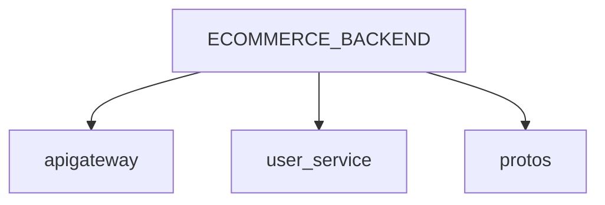

# ECOMMERCE_BACKEND

This ecommerce app is build based on a microservice architecture.
```mermaid


```



## Services

### 1. Api Gateway
Responsible for API orchestrated using Graphql


### 2. User Service
Handle **authentication** and user related business logics

[//]: # (### 2. Product Service)

[//]: # (### 2. Order Service)

[//]: # (### 2. Payment Service)


[//]: # (Here are commonly used Markdown syntax elements essential for developers:)

[//]: # (1. Headings: # Heading 1, ## Heading 2, and ### Heading 3 &#40;up to six levels&#41;.)

[//]: # (2. Emphasis:)

[//]: # (   Bold: **bold text** or __bold text__)

[//]: # (   Italic: *italic text* or _italic text_)

[//]: # (   ~~Strikethrough:~~ ~~strikethrough text~~)

[//]: # (3. Lists:)

[//]: # (   Unordered Lists:)

[//]: # (* Item 1)

[//]: # (* Item 2)

[//]: # (  Ordered Lists:)

[//]: # (1. Item A)

[//]: # (2. Item B)

[//]: # (   Task Lists:)

[//]: # (- [x] Completed task)

[//]: # (- [ ] Incomplete task)

[//]: # (4. Code:)

[//]: # (   Inline Code: This is some inline code.)

[//]: # (   Code Blocks &#40;with syntax highlighting&#41;:)

# sequenceDiagram
```mermaid
sequenceDiagram
    box  Client & Api Gateway
    participant C as Client
    participant AG as ApiGateway
    end
    box  Services
    participant US as UserService
    participant USDB as UserServiceDB
    end
   
    activate C
    C->>+ AG: Sends a GraphQL registerUser request
    AG->>+ US: make a registerUser rpc call to UserService
    US->>USDB: get user with email
    US->>US: validate email
    alt exists
    US-->>AG: user Exist Error
    else notFound
    US->>+ USDB: Inserts User to DB
    US-->>AG: register user respose
    end
    AG-->> C: register user response 
    C->>AG: loginUser Request
    AG->>US: loginUser request
    US->>USDB: get user by email
    USDB-->>US: user record
    US->>US: Validate email and password,Authenticate, generate access and refresh tokens
    US-->>AG: access and refresh token
    AG-->>C: access and refresh token
    C->>AG: getCurrentUser
    AG->>US: getCurrentUser
    US->>USDB: getCurrentUser
    USDB-->>- US: currentUser
    US-->>- AG: currentUser
    AG-->>- C: currentuser
    deactivate C
 ```
     
     

